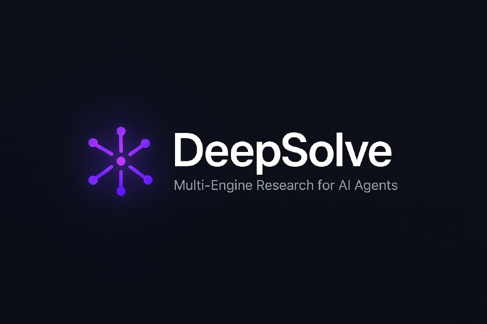

<p align="center">
  
</p>

<p align="center">
  <strong>Every other tool stops at the first answer. We start there.</strong>
</p>

<p align="center">
  <a href="https://modelcontextprotocol.io"></a>
  <a href="https://deepsolve.cc"></a>
  <a href="https://deepsolve.cc"></a>
</p>

**DeepSolve** is a research MCP server that cross-references **6 specialized search engines** with **S-Score confidence scoring**. Not a chatbot. A research lab for your AI agent.

🌐 **Website:** [deepsolve.cc](https://deepsolve.cc)

---

## The Problem

AI tools give you one answer from one source. Confident. Convincing. Sometimes wrong.

There's no way to know which claims are confirmed by multiple independent sources, and which ones are single-source speculation.

**DeepSolve fixes this.**

---

## Three Tools

### 🔬 Deep Solve
Full research pipeline for complex problems. 6 engines query in parallel, cross-verify findings, and produce a convergence matrix with S-Score confidence on every claim.

**Try it:** just tell your agent:

> *"Use DeepSolve to help me solve this GitHub issue: https://github.com/user/project/issues/42, the build fails on Node 22 and I can't figure out why."*

More examples:
- *"Deep Solve: compare Rust vs Go for a high-throughput API serving 10M requests/day"*
- *"Use DeepSolve to analyze the tokenomics of [project], is the supply model sustainable?"*
- *"I need to migrate from Webpack to Vite but my project has 200+ dependencies. Use DeepSolve to find the safest approach."*

→ 14-20 queries · S-Score matrix · Second-order effects · Ready-to-execute action plan

---

### 🧪 Creative Lab
Cross-domain exploration with **biomimicry**, **mechanics**, **anti-consensus** analysis, weak signal detection, and forced collision between unrelated concepts. Find ideas no one has combined before.

**Try it:**

> *"Use Creative Lab to explore how ant colony behavior could inspire a better distributed database"*

More examples:
- *"Creative Lab: what can immune system T-cells teach us about API rate limiting?"*
- *"Use Creative Lab to find unexpected connections between Japanese pottery repair (kintsugi) and software error handling"*
- *"Creative Lab: explore how mycelium networks could inspire a new approach to social media algorithms"*

→ 6+ domains explored · Biomimicry · Mechanics · Weak signals · Forced collisions · Novel combinations

---

### ✅ Verify
Multi-engine fact-checking. Give it any claim, get a verdict: **VERIFIED**, **CONTESTED**, or **REFUTED** with S-Score confidence.

**Try it:**

> *"Use DeepSolve to verify: GPT-5 can run locally on consumer hardware"*

More examples:
- *"Verify: Solana processes 65,000 transactions per second"*
- *"Verify: React Server Components reduce bundle size by 30%"*
- *"Verify: the average AI startup burns through seed funding in 14 months"*

→ S-Score confidence · VERIFIED / CONTESTED / REFUTED · Sources counted

---

## How It Works

```
Your question or goal
        ↓
   🎯 Mission created (scope, brief, objectives)
        ↓
   6 Specialized Engines (parallel)
        ↓
   Cross-verification (blind re-check)
        ↓
   S-Score convergence matrix
        ↓
   ✅ VERIFIED · ⚠️ CONTESTED · ❌ REFUTED
```

Every finding is scored. Every claim is verified. No guessing.

---

## ⚡ Get Started in 60 Seconds

### Step 1: Get your free API key

Go to **[deepsolve.cc](https://deepsolve.cc)** → click **Get Started Free** → you'll receive your API key instantly.

Free plan includes: 3 Verify/day · 2 Deep Solve/week · 1 Creative Lab/week

### Step 2: Add DeepSolve to your agent

Pick your agent below. Each guide is step-by-step.

<details>
<summary><strong>Claude Desktop</strong></summary>

1. Open **Claude Desktop** on your computer
2. Click the **hamburger menu** (☰, top-left corner)
3. Go to **Settings**
4. Click **Developer** in the left sidebar
5. Click **Edit Config** (this opens a JSON file in your text editor)
6. Replace the content with the config below (or merge it if you already have other servers):
```json
{
  "mcpServers": {
    "deepsolve": {
      "url": "https://api.deepsolve.cc/mcp",
      "headers": {
        "Authorization": "Bearer YOUR_API_KEY"
      }
    }
  }
}
```
7. **Save** the file
8. **Restart** Claude Desktop (close and reopen it)
9. Done! Claude now has access to DeepSolve tools automatically. Just ask your question.

**Config file location:**
- macOS: `~/Library/Application Support/Claude/claude_desktop_config.json`
- Windows: `%APPDATA%\Claude\claude_desktop_config.json`
- Linux: `~/.config/claude/claude_desktop_config.json`

</details>

<details>
<summary><strong>Claude Code (terminal)</strong></summary>

1. Open your terminal
2. Run this command:
```bash
claude mcp add deepsolve --transport http https://api.deepsolve.cc/mcp
```
3. When prompted for headers, enter: `Authorization: Bearer YOUR_API_KEY`
4. Done! Claude Code now has access to DeepSolve tools. Just ask your question.

</details>

<details>
<summary><strong>Cursor</strong></summary>

1. Open **Cursor**
2. Go to **Settings** (gear icon, or press `Cmd+,` / `Ctrl+,`)
3. Type **MCP** in the search bar
4. Click **Add new MCP server**
5. Set the name to `deepsolve`
6. Set the URL to `https://api.deepsolve.cc/mcp`
7. Add this header: `Authorization: Bearer YOUR_API_KEY`
8. Click **Save**
9. Done! Cursor now has access to DeepSolve tools. Just ask your question.

</details>

<details>
<summary><strong>Cline (VS Code extension)</strong></summary>

1. Open **VS Code** with the Cline extension installed
2. Click the **gear icon** (⚙️) in the Cline sidebar panel
3. Go to **MCP Servers**
4. Click **Add MCP Server**
5. Paste this config:
```json
{
  "deepsolve": {
    "url": "https://api.deepsolve.cc/mcp",
    "headers": {
      "Authorization": "Bearer YOUR_API_KEY"
    }
  }
}
```
6. Click **Save**
7. Done! Cline now has access to DeepSolve tools. Just ask your question.

</details>

<details>
<summary><strong>Windsurf</strong></summary>

1. Open **Windsurf**
2. Go to **Settings**
3. Navigate to **AI > MCP Servers**
4. Click **Add Server**
5. Paste this config:
```json
{
  "deepsolve": {
    "url": "https://api.deepsolve.cc/mcp",
    "headers": {
      "Authorization": "Bearer YOUR_API_KEY"
    }
  }
}
```
6. Click **Save**
7. Done! Windsurf now has access to DeepSolve tools. Just ask your question.

</details>

<details>
<summary><strong>VS Code (MCP extension)</strong></summary>

1. Install the **MCP extension** from the VS Code Marketplace
2. Create a file called `.vscode/mcp.json` in your project folder
3. Paste this content:
```json
{
  "servers": {
    "deepsolve": {
      "url": "https://api.deepsolve.cc/mcp",
      "headers": {
        "Authorization": "Bearer YOUR_API_KEY"
      }
    }
  }
}
```
4. Save the file
5. Done! VS Code now has access to DeepSolve tools through the MCP extension.

</details>

<details>
<summary><strong>OpenClaw</strong></summary>

OpenClaw works with any LLM you've configured (Claude, GPT, Gemini, Mistral, etc.).

1. Open your OpenClaw config file: `~/.openclaw/openclaw.json`
2. Find the `"mcp"` section (create it if it doesn't exist)
3. Add DeepSolve:
```json
"mcp": {
  "servers": {
    "deepsolve": {
      "url": "https://api.deepsolve.cc/mcp",
      "headers": {
        "Authorization": "Bearer YOUR_API_KEY"
      }
    }
  }
}
```
4. Save the file
5. Restart your gateway:
```bash
openclaw gateway restart
```
6. Done! Your OpenClaw agent now has access to DeepSolve tools. Just ask your question.

</details>

<details>
<summary><strong>Hermes</strong></summary>

1. Open your Hermes config file (usually `~/.hermes/config.json` or the settings panel)
2. Add a new MCP server with these settings:
   - **Name:** `deepsolve`
   - **URL:** `https://api.deepsolve.cc/mcp`
   - **Transport:** Streamable HTTP
   - **Header:** `Authorization: Bearer YOUR_API_KEY`
3. Save and restart Hermes
4. Done! Hermes now has access to DeepSolve tools. Just ask your question.

</details>

<details>
<summary><strong>Other MCP-compatible agents</strong> (Continue, Roo Code, Goose, Zed, LibreChat, 5ire...)</summary>

All MCP-compatible agents use the same connection details. Look for "Add MCP Server" or "Add Tool Server" in your agent's settings, then use:

- **URL:** `https://api.deepsolve.cc/mcp`
- **Transport:** Streamable HTTP
- **Auth header:** `Authorization: Bearer YOUR_API_KEY`

</details>

> **Note:** Once configured, your agent automatically knows DeepSolve is available. You don't need to tell it "I installed DeepSolve." Just ask your question and the agent will use the right tool.

### Step 3: Ask your agent anything

That's it. No installation, no clone, no build. Just ask:

> *"Use DeepSolve to find why my CI pipeline fails on Node 22"*

**Not sure which tool to use?** Just ask your agent:

> *"Which one between DeepSolve and Creative Lab should I use for [your problem]?"*

Your agent will pick the right tool and explain why.

---

## What Makes DeepSolve Different

| | Perplexity | ChatGPT | 🔬 Deep Solve | 🧪 Creative Lab |
|--|-----------|---------|---------------|-----------------|
| Purpose | General Q&A | General Q&A | Solve a specific problem with verified research | Explore new ideas by colliding unrelated domains |
| Search engines | 1 | 1 | **6 specialized** | **6 specialized** |
| Cross-verification | ❌ | ❌ | ✅ Blind re-check | ✅ Cross-pollination |
| Confidence scoring | ❌ | ❌ | ✅ S-Score per claim | ✅ S-Score per insight |
| Convergence matrix | ❌ | ❌ | ✅ Multi-source | ✅ Multi-domain |
| Biomimicry | ❌ | ❌ | ❌ | ✅ Biology-inspired patterns |
| Mechanics | ❌ | ❌ | ❌ | ✅ Engineering cross-domain |
| Anti-consensus | ❌ | ❌ | ❌ | ✅ Contrarian queries |
| Action plan output | ❌ | Partial | ✅ Ready-to-execute | ✅ Novel hypotheses |
| MCP native | ❌ | ❌ | ✅ Zero friction | ✅ Zero friction |

**Deep Solve** converges: find THE answer, cross-verified across 6 engines.
**Creative Lab** diverges: find connections no one has made, across biology, mechanics, history, philosophy.

---

## Pricing

| | Free | Starter | Pro | Team |
|--|------|---------|-----|------|
| **Price** | $0 | $19/mo | $39/mo | $79/mo |
| **Verify** | 3/day | 10/day | 25/day | 100/day |
| **Deep Solve** | 2/week | 2/day | 5/day | 15/day |
| **Creative Lab** | 1/week | 1/day | 3/day | 10/day |
| **Smart Recommend** | ✅ | ✅ | ✅ | ✅ |
| **Dashboard** | — | 30 days | 30 days + export | 30 days + export |
| **Genesis** | — | — | 🔜 | 🔜 |

---

## 🧬 Genesis (Coming Soon)

Don't search for what exists. **Invent what doesn't.**

Genesis doesn't research, it creates. Cartography of ignorance, forced collision between impossible domains, and a multi-gate anti-fixation filter that guarantees genuine novelty.

Available on **Pro** and **Team** plans when launched.

---

## FAQ

<details>
<summary><strong>What is MCP?</strong></summary>

Model Context Protocol (MCP) is an open standard that lets AI agents use external tools. DeepSolve is an MCP server: your agent connects to it and gains research superpowers. No browser extension, no copy-paste. Your agent calls DeepSolve directly.
</details>

<details>
<summary><strong>Which agents are compatible?</strong></summary>

Any MCP-compatible client: **Claude Desktop**, **Claude Code**, **Cursor**, **Cline**, **Windsurf**, **VS Code** (with MCP extension), **OpenClaw**, **Hermes**, **Continue**, **Roo Code**, **Goose**, **Zed**, **LibreChat**, **5ire**, and more. If your agent supports MCP, it works with DeepSolve.
</details>

<details>
<summary><strong>How is this different from Perplexity or ChatGPT?</strong></summary>

Perplexity and ChatGPT use one search source and give you one perspective. DeepSolve queries 6 specialized engines in parallel, cross-verifies findings, and scores every claim with S-Score confidence. You see exactly what's confirmed, what's contested, and what's refuted. Creative Lab goes further by crossing biology, mechanics, and philosophy to find ideas nobody has combined before.
</details>

<details>
<summary><strong>What are the 6 engines?</strong></summary>

DeepSolve uses 6 specialized research engines, each optimized for different types of information: semantic understanding, factual verification, precision data, deep analysis, academic papers, and scholarly citations. Engine names are internal. What matters is the cross-verified result.
</details>

<details>
<summary><strong>What is S-Score?</strong></summary>

S-Score is a calibrated confidence metric. It measures how many independent engines confirm a finding, minus contradictions found during cross-verification. S ≥ 0.70 = solid foundation. S < 0.40 = treat with caution.
</details>

<details>
<summary><strong>Is my data private?</strong></summary>

Your queries are processed and cached for performance (same query = instant response). We don't train on your data, sell it, or share it. Mission history is available for 30 days on paid plans, then deleted.
</details>

<details>
<summary><strong>Can I self-host this?</strong></summary>

DeepSolve is a hosted service. Self-hosting is not available. The value is in the engine orchestration, cross-verification pipeline, and maintained infrastructure.
</details>

<details>
<summary><strong>Do I need API keys for the search engines?</strong></summary>

No. DeepSolve handles all engine access. You only need your DeepSolve API key. Zero configuration beyond 3 lines of config.
</details>

<details>
<summary><strong>Does my agent know DeepSolve is installed?</strong></summary>

Yes, automatically. Once you add the MCP config, your agent discovers DeepSolve's tools on its own. You don't need to tell it "I installed DeepSolve." Just describe your problem and the agent will use the right tool.
</details>

---

## Built by [@KaizenBuild](https://x.com/KaizenBuild)

Building AI agents in public. DeepSolve was born from real frustration: AI research tools that confidently give wrong answers with no way to verify them.

---

<p align="center">
  <a href="https://deepsolve.cc">🌐 Website</a> ·
  <a href="https://deepsolve.cc/#pricing">💰 Pricing</a> ·
  <a href="https://x.com/KaizenBuild">🐦 Follow on X</a>
</p>
